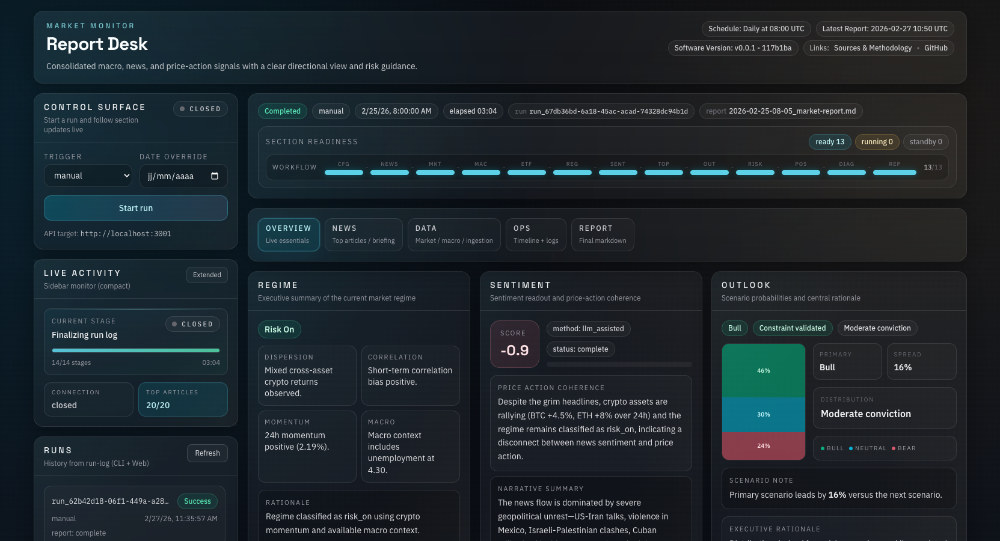

<div align="center">

# Market Monitor

**Automated market intelligence agent that turns hours of manual analysis into a 5-minute daily report.**



</div>

## Why this project

Before this project, the workflow was human-heavy:

- read and triage hundreds of news items
- cross-check market and macro data manually
- synthesize sentiment and risk scenarios
- write a structured morning note

That process can easily take **1 to 3+ hours per day**.

`market-monitor` compresses that work into an automated pipeline that typically runs in around **5 minutes**, while keeping outputs structured, traceable, and reproducible.

It combines:

- RSS news intake (multi-source)
- market snapshots (CoinGecko + Hyperliquid)
- macro context (FRED + Farside ETF flows)
- deterministic rules + Markdown skills
- reproducible Markdown report generation

## Impact at a glance

- Replaces a repetitive manual workflow with an autonomous agent run
- Processes large-scale daily news intake (often hundreds, potentially close to ~1,000 raw items depending on feeds/day)
- Produces market sentiment, regime, probabilistic outlook, and risk invalidation in one pass
- Converts hours of daily analyst effort into minutes
- Standardizes output quality with deterministic + testable components

## What it does

- Starts analysis runs from CLI (`review run`) or API (`POST /api/runs`)
- Aggregates news, market data, macro data, and ETF flow data
- Computes regime, sentiment, probabilistic outlook, risk invalidation, and positioning wording
- Writes reports to `reports/*.md`
- Logs run history to `logs/runs.jsonl` and per-run event streams to JSONL
- Exposes live run updates via SSE

## Engineering Value

This is not just a script that fetches data. It is an end-to-end agent system designed for reliability and repeatability:

- composable architecture (ingestion, analysis, runtime, reporting, UI)
- deterministic checks plus optional LLM augmentation
- CLI, API, scheduler, and web dashboard in one cohesive workflow
- event logs and run history for auditability
- test coverage across unit and functional layers

## Methodology (How Sentiment, Regime, and Outlook Are Produced)

This report is generated through a staged pipeline, not a single black-box prompt.

### 1. Data intake and normalization

- RSS feeds are fetched and parsed into normalized news items.
- Duplicates are removed using a fingerprint built from normalized URL + title + date.
- Market snapshots are pulled from configured providers (CoinGecko/Hyperliquid).
- Macro context is pulled from FRED series (for example CPI, M2, PCE, UNRATE).
- ETF flow context is added from Farside.

### 2. News prioritization (high-signal filtering)

- Each article gets a deterministic relevance score based on recency, policy/macro/regulation/risk keywords, watchlist token matches, and source cues (with generic-recap penalties).
- The engine prefilters a large candidate pool and selects a focused top list (default target: 20 items) for deeper reading and synthesis.
- Optional LLM ranking can refine this prioritization while preserving deterministic fallbacks.

### 3. Regime detection

Regime is rule-based and reproducible:

- Inputs: average 24h returns, average 7d returns, and macro context (notably unemployment when available).
- `risk_on` when short-term momentum is positive and macro does not signal stress.
- `risk_off` when short-term momentum is materially negative.
- Otherwise `transition`.

This produces explicit rationale and component signals (momentum, dispersion, correlation, macro).

### 4. Sentiment scoring

Two execution paths exist:

- Deterministic baseline combines short-term price action with headline keyword bias and outputs a bounded score in `[-2, 2]` plus a coherence narrative.
- Optional LLM-assisted path uses skill bindings to refine assessment; output is normalized/sanitized and constrained to the same score range.
- On LLM failure, the run degrades gracefully and keeps traceability.

### 5. Probabilistic outlook (bull/base/bear)

Outlook is derived from regime + sentiment under hard constraints:

- starts from a neutral prior (`30 / 40 / 30`)
- adjusts by regime (`risk_on` or `risk_off`) and sentiment score
- normalized to integer percentages
- each bucket constrained to `[0, 70]`
- final distribution forced to sum exactly to `100`

Primary scenario is selected from the highest probability bucket.

### 6. Risk invalidation and positioning

- Risk invalidation is generated from regime state, top market movers, and key macro checkpoints.
- Position wording is produced via deterministic templates or LLM skill bindings, with strict output structure and safe fallback behavior.

### 7. Reliability and auditability principles

- Every run emits staged events and persistent logs.
- Report generation can complete as `incomplete` when optional LLM components fail, instead of silently dropping the run.
- Deterministic components ensure reproducibility; optional LLM layers improve expressiveness without owning core control flow.

## Live Preview (Current Limitations)

A public live preview currently exists, but it is intentionally limited.

- The public preview is **static / read-only** and runs with no backend.
- Report generation is performed automatically by **GitHub Actions**.
- Generated artifacts are published to repository branches and consumed by the static front.
- Because there is no live backend in preview mode, interactive run orchestration is restricted.

If you want full capabilities (manual runs, scheduler behavior, API endpoints, live SSE runs), run the project locally.

## Run Locally for Full Features

You can download/clone this project for personal use and unlock the full feature set:

- full CLI workflows
- backend API + SSE live events
- local scheduler execution
- custom config, skills, and environment tuning

## Stack

- Runtime: Bun + TypeScript
- CLI: Bun commands (`src/cli/*`)
- API: Bun server (`server/src/index.ts`)
- Frontend: React + Vite + Tailwind (`web/`)
- Testing: Vitest (unit + functional)

## Project Structure

```text
.
├── config/                  # rss-feeds.md + watchlist.json
├── skills/                  # Markdown skills (sentiment, outlook, positioning)
├── src/                     # core engine (ingest, analysis, report, runtime)
├── server/                  # HTTP API + SSE
├── web/                     # React dashboard
├── reports/                 # generated reports
├── logs/                    # run history + event logs
└── tests/                   # unit and functional tests
```

## Requirements

- Bun installed (`>= 1.x` recommended)
- Node.js available (useful for TypeScript/Vite tooling)
- Network access for external providers (RSS, CoinGecko, FRED, Farside, Hyperliquid)

## Installation

```bash
bun install
```

## Quick Start

1. Validate configuration:

```bash
bun run dev -- config validate
```

2. Run one manual review:

```bash
bun run dev -- review run
```

3. Check outputs:

- reports: `reports/*.md`
- run log: `logs/runs.jsonl`

4. Optional: start API + web UI:

```bash
# terminal 1
bun run dev:server

# terminal 2
bun run dev:web
```

## CLI Commands

### Validate config

```bash
bun run dev -- config validate
```

Validates:

- `config/rss-feeds.md`
- `config/watchlist.json`
- `skills/**/*.md`
- runtime env constraints (`REPORTS_DIR`, `RUN_LOG_PATH`, etc.)

### Manual run

```bash
bun run dev -- review run
```

Options:

- `--trigger manual|scheduled`
- `--date YYYY-MM-DD`

Example:

```bash
bun run dev -- review run --date 2026-02-27
```

### Scheduler

Single scheduler tick:

```bash
bun run dev -- scheduler start --time 08:15 --once
```

Continuous scheduler loop:

```bash
bun run dev -- scheduler start --time 08:15
```

## HTTP API (Server)

Default port: `3001` (`PORT` is configurable)

- `GET /api/health`
- `GET /api/runs`
- `POST /api/runs`
- `GET /api/runs/:runId/events` (SSE)
- `GET /api/runs/:runId/report`

Start server:

```bash
bun run dev:server
```

## Web Dashboard

Start dev server:

```bash
bun run dev:web
```

Build:

```bash
bun run build:web
```

Useful frontend env vars:

- `VITE_API_BASE_URL` (default: `http://localhost:3001`)
- `VITE_APP_MODE` (`interactive` or `public`)
- `VITE_PUBLIC_DATA_BASE_URL` (for public/static mode)

## Environment Variables

Core vars:

- `REPORTS_DIR` (default: `reports`)
- `RUN_LOG_PATH` (default: `logs/runs.jsonl`, must end with `.jsonl`)
- `FRED_API_KEY` (optional, recommended)
- `COINGECKO_API_KEY` (optional)
- `HYPERLIQUID_DEX` (optional)

Optional LLM vars:

- `LLM_PROVIDER` = `ollama` or `gemini`
- `LLM_MODEL`
- `LLM_API_KEY`
- `LLM_BASE_URL`

Provider notes:

- `ollama`: usually requires `LLM_BASE_URL` + `LLM_MODEL`
- `gemini`: requires `LLM_API_KEY` + `LLM_MODEL` (`LLM_BASE_URL` optional)

## Content Configuration

### RSS sources

File: `config/rss-feeds.md`

- front matter (`version`, `updated_at`, `default_lookback_hours`)
- Markdown table of sources

### Watchlist

File: `config/watchlist.json`

- enable/disable instruments (`enabled`)
- supported providers: `coingecko`, `hyperliquid`

### Skills

Directory: `skills/**/*.md`

- versioned Markdown skills
- deterministic and/or LLM-backed bindings

## Generated Outputs

- reports: `reports/YYYY-MM-DD-HH-mm_market-report.md`
- run history: `logs/runs.jsonl`
- per-run event logs: `logs/run-events/<runId>.jsonl`

If an LLM binding fails, the system can still produce an `incomplete` report while preserving run history and diagnostics.

## Quality and Testing

```bash
bun run build
bun run test:unit
bun run test:functional
bun run test:coverage
```

## Quick Troubleshooting

- `Environment validation failed`:
  check env vars (especially `RUN_LOG_PATH`, `LLM_PROVIDER`)
- `ENOENT` on config files:
  verify `config/rss-feeds.md` and `config/watchlist.json` exist
- no LLM output:
  expected when LLM vars are not configured
- empty dashboard:
  verify API server is running and `VITE_API_BASE_URL` is correct

## Possible Roadmap

- API authentication + tighter CORS
- analytical persistence for cross-run comparisons
- alerting integrations (Slack/Telegram/Discord)
- cloud deployment (scheduled worker + static frontend)

## License

This project is open source.
